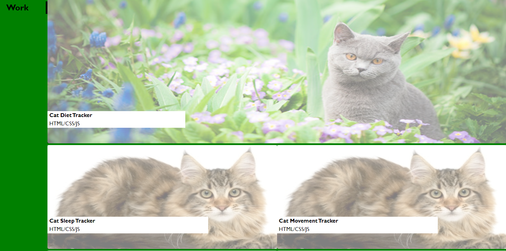

#<matt-carlson-portfolio>

## Description-
This is my portfolio.  It will be continously updated as I progress through my career as a software engineer.

To start off, I wrote the HTML.  We were provided a template to follow which helped.  Since this is just a starter that will then be updated with projects, I decided to use cats as my placeholder images because I like them.  For my inspirational quote I picked a lyric from a band I like.  It was tricky to make the banner the right size, so I ended up putting the specifications inline rather than in the separate CSS file.  The reset css file also helped greatly.

Then came the fun part- the CSS.  CSS has never been my strongest language but it felt good to push myself on this.  Lots of experimentation happened, particularly on the flexbox.  The work section was definitely the most challenging part of this.  Getting all the cats to lineup was difficult and I ended up switching between floats and flexbox a couple times.  

At this point I feel like I am building a solid foundation for the future as I use this portfolio in my professional career.

## Contributors-
I did the editing, and received help from both my instructor John and TA Michael.  The lyric in the cover is from a song called "Underwater Bimbos from Outer Space" by the band Every Time I Die.  The reset CSS file is from the class lesson on variables.

## Usage-
If you would like to view my portfolio, you can view it here: https://mrmrc182.github.io/matt-carlson-portfolio/ 

Click on the links in the heading and contact section, all of them have hyperlinks.

Hover your mouse over the cats to see a fun transition.  I have attached a screenshot here for a visual reference.

## License-
Matt Carlson Code 2022.